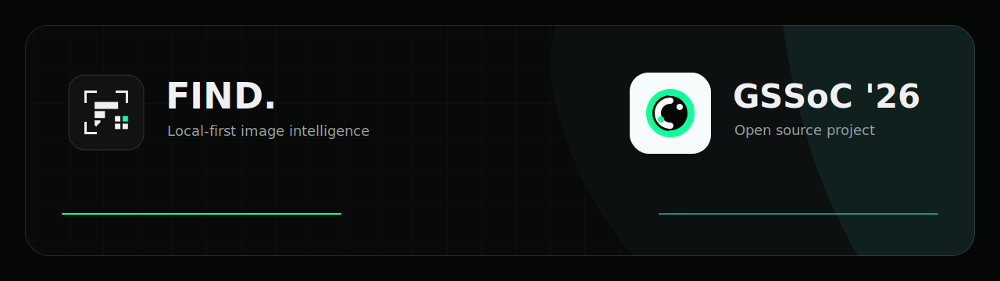
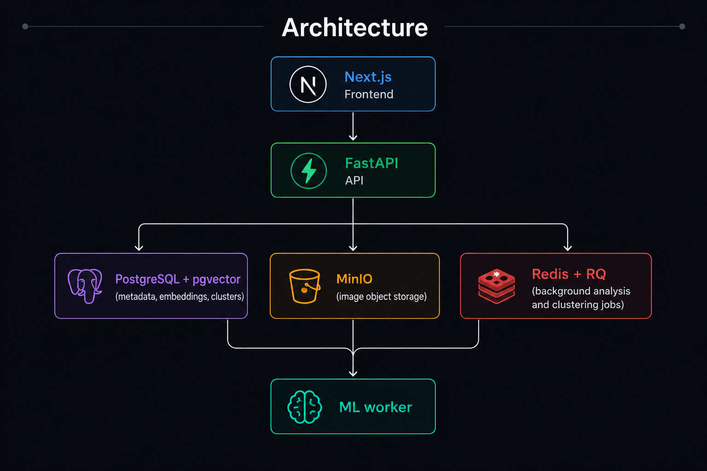
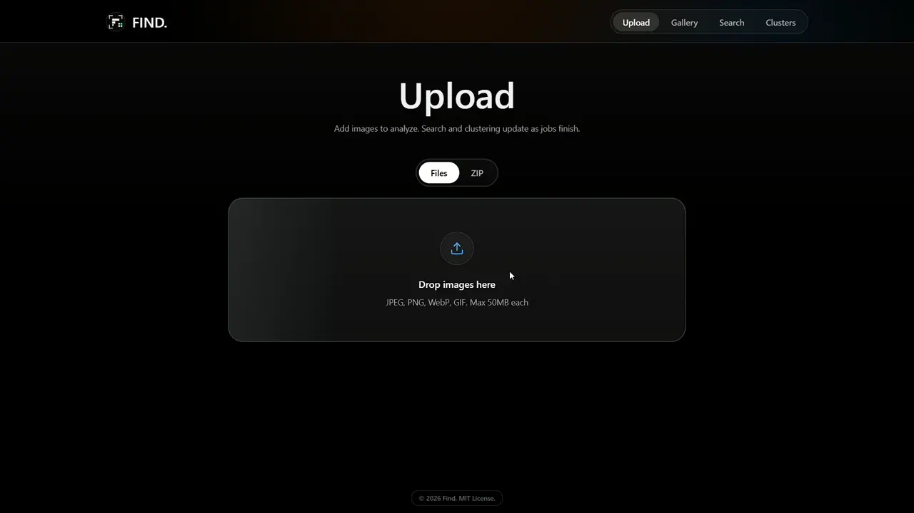
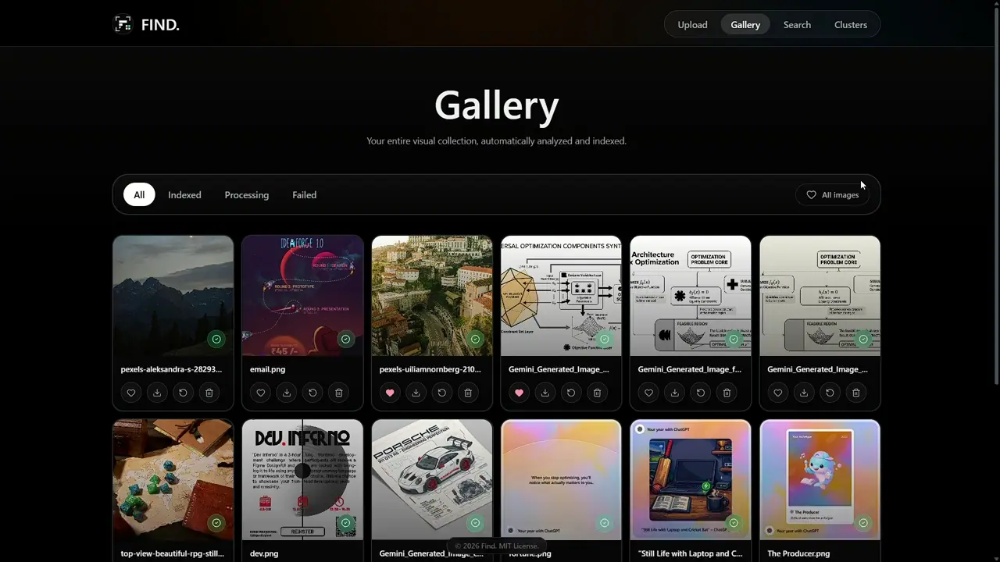
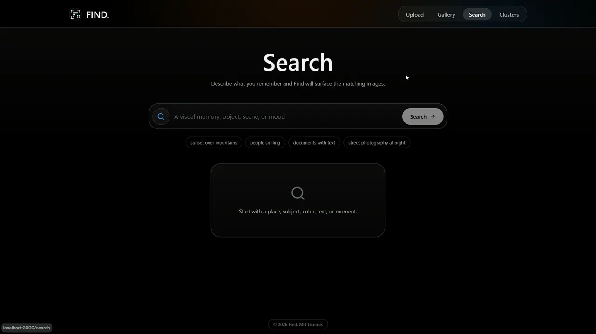
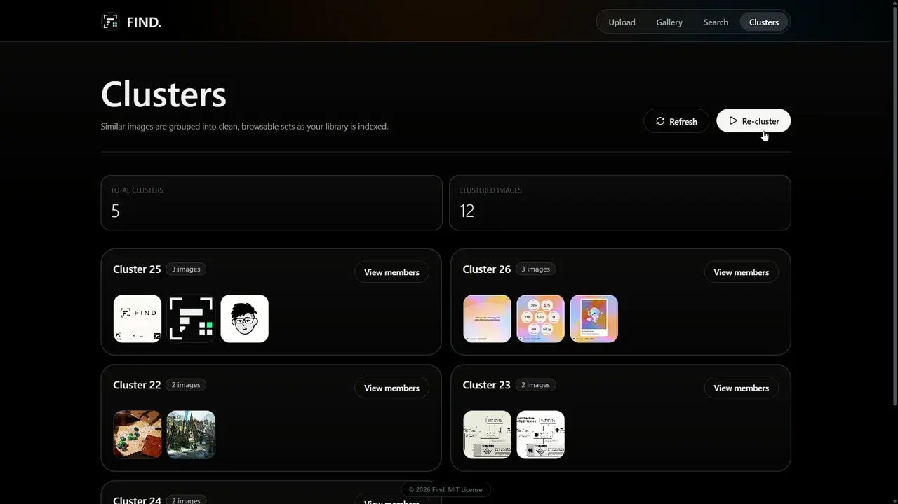
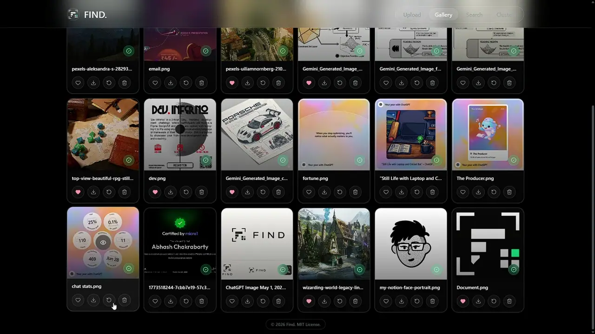
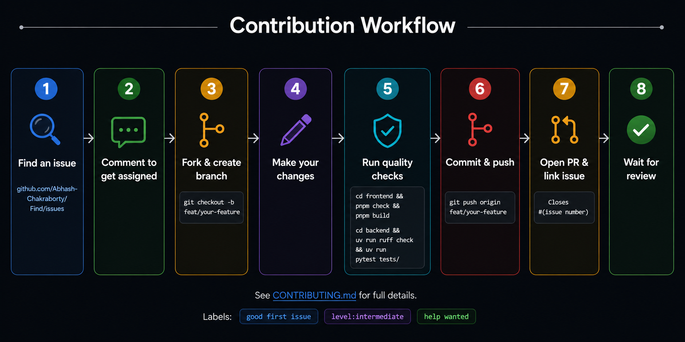

# Find

<p align="center">
  <a href="https://gssoc.girlscript.org/"></a>
  <a href="https://github.com/Abhash-Chakraborty/Find/actions/workflows/ci.yml"></a>
  <a href="https://github.com/Abhash-Chakraborty/Find/labels/good%20first%20issue"></a>
  <a href="https://github.com/Abhash-Chakraborty/Find/issues"></a>
  <a href="./LICENSE"></a>
</p>

<p align="center">
  
</p>

Find is a local-first AI image intelligence platform for uploading, indexing, searching, and clustering images on your own machine.

All image processing, vector generation, and search stay inside your local stack.

See the mobile direction in [`docs/mobile-strategy.md`](./docs/mobile-strategy.md), the desktop framework tradeoff analysis in [`docs/desktop-tauri-vs-electron-adr.md`](./docs/desktop-tauri-vs-electron-adr.md), and the broader installable local-first roadmap in [`docs/installable-local-first-architecture-roadmap.md`](./docs/installable-local-first-architecture-roadmap.md).

## What it does

- Upload individual images or ZIP archives
- Extract captions, detected objects, OCR text, EXIF metadata, and dimensions
- Generate hybrid embeddings for semantic search
- Automatically cluster related images after indexing completes
- Browse gallery, inspect details, like/delete media, and review cluster members

## Tech stack

- **Frontend:** Next.js 16, React 19, React Query, Tailwind CSS, Biome
- **Backend:** FastAPI, SQLAlchemy, PostgreSQL + pgvector, Redis, RQ, MinIO
- **ML pipeline:** YOLOv10, Florence-2, PaddleOCR, SigLIP (`open-clip`), HDBSCAN

## Architecture



## Screenshots

### Upload



### Gallery



### Search



### Clusters



## Delete



## GSSoC'26 contributors

This project is open for **GSSoC'26** contributions.

- New contributors should start with the [GSSoC'26 Contributor Guide](./GSSOC_CONTRIBUTOR_GUIDE.md).
- For concise repo-aware contributor and coding-agent workflow guidance, start with [AGENTS.md](./AGENTS.md).
- Start with issues labeled [`good first issue`](https://github.com/Abhash-Chakraborty/Find/labels/good%20first%20issue)
- Beginner-friendly work may also use [`level:beginner`](https://github.com/Abhash-Chakraborty/Find/issues?q=state%3Aopen%20label%3A%22level%3Abeginner%22)
- For bigger work, check [`level:intermediate`](https://github.com/Abhash-Chakraborty/Find/issues?q=state%3Aopen%20label%3A%22level%3Aintermediate%22), [`level:advanced`](https://github.com/Abhash-Chakraborty/Find/issues?q=state%3Aopen%20label%3A%22level%3Aadvanced%22), and [`level:critical`](https://github.com/Abhash-Chakraborty/Find/issues?q=state%3Aopen%20label%3A%22level%3Acritical%22)
- Look for priority queue items via [`help wanted`](https://github.com/Abhash-Chakraborty/Find/labels/help%20wanted)
- Follow the contribution rules in [CONTRIBUTING.md](./CONTRIBUTING.md)

## Install and run

### Option A: one-command demo stack (recommended)

From repository root:

```bash
docker compose up --build
```

Services:

- Frontend: `http://localhost:3000`
- Backend API: `http://localhost:8000`
- MinIO API: `http://localhost:9200`
- MinIO console: `http://localhost:9201`

Notes:

- Current Docker setup is GPU-oriented and expects NVIDIA GPU access.
- If no root `.env` is present, compose defaults support local demo startup.

### Option B: fast contributor mode

For UI, API, upload, gallery, search, clustering, docs, and workflow changes, use the light stack:

```bash
docker compose -f docker-compose.light.yml up --build
```

This runs the same app flow with `ML_MODE=mock`, a Python slim backend image, and no GPU/model cache mount. It avoids downloading Florence-2, SigLIP, PaddleOCR, YOLO, CUDA PyTorch, and related model weights, so first-time setup is much smaller and faster.

Light mode is deterministic but not AI-accurate:

- Uploads still go through MinIO, PostgreSQL, Redis, RQ, and the worker.
- The worker records image dimensions, EXIF, mock metadata, and schema-compatible vectors.
- Search and clustering exercise the same API/database paths using mock embeddings.
- Use the full stack before validating real ML quality or performance.

## Mock mode vs full ML mode

Find ships two runtime modes that serve different purposes. Choosing the wrong one is the most common source of contributor confusion.

### Mock mode (light stack)

```bash
docker compose -f docker-compose.light.yml up --build
```

`ML_MODE=mock` is set automatically. The worker skips all model loading and instead records:

| Field | What you get |
|---|---|
| Caption | A fixed placeholder string (e.g. `"mock caption"`) |
| Detected objects | An empty list or a static stub |
| OCR text | An empty string |
| Embedding vector | A zero-filled or seeded deterministic vector of the correct dimension |
| EXIF / dimensions | **Real values** extracted from the actual image file |

Because mock vectors have no semantic content, search results are meaningless — results may appear but their ranking is arbitrary and does not reflect real image similarity.

**Mock mode is the right choice when you are working on:**

- Frontend UI, layout, or styling
- API routing, request/response shapes, or error handling
- Upload, job-status polling, gallery, or delete/like flows
- Clustering pipeline logic (not cluster quality)
- Documentation, CI, or contributor-tooling changes

### Full ML mode (full stack)

```bash
docker compose up --build
```

The worker loads Florence-2 (captioning), YOLOv10 (object detection), PaddleOCR (text extraction), and SigLIP via `open-clip` (semantic embeddings). All metadata and vectors reflect real model output.

**Full ML mode is required when you are working on or reporting:**

- Caption quality or wording
- Search relevance — whether the right images appear for a query
- Object detection accuracy
- OCR output correctness
- Clustering quality (which images group together)
- Any ML model parameter or pipeline change

> ⚠️ **Do not report caption or search quality issues observed in mock mode.** Mock output is intentionally fake and will not reproduce in production. Always reproduce ML-quality claims in full mode before filing a bug.

### Quick reference

| Task | Use light stack? | Use full stack? |
|---|---|---|
| UI fix or new component | ✅ Yes | Not needed |
| API endpoint change | ✅ Yes | Not needed |
| Upload / gallery / clusters flow | ✅ Yes | Not needed |
| Docs / CI / tooling | ✅ Yes | Not needed |
| Caption looks wrong | ❌ No | ✅ Required |
| Search returns bad results | ❌ No | ✅ Required |
| OCR missed text | ❌ No | ✅ Required |
| ML pipeline performance | ❌ No | ✅ Required |

First run of the full stack downloads Florence-2, SigLIP, PaddleOCR, and YOLO weights (several GB). Models are cached in the `model_cache` Docker volume and reused on subsequent runs.


### Option C: local development without Docker

#### Prerequisites

- Node.js 18+ and `pnpm`
- Python 3.12 and `uv`
- PostgreSQL with `pgvector`
- Redis
- MinIO (or S3-compatible storage)

#### 1. Clone and configure env

```bash
git clone https://github.com/Abhash-Chakraborty/Find.git
cd Find
cp .env.example .env
```

#### 2. Backend API

```bash
cd backend
uv sync --group dev
uv run uvicorn find_api.main:app --reload
```

Use `uv sync --group dev --extra ml` only when you need real local ML inference outside Docker.

#### 3. Worker (separate terminal)

```bash
cd backend
uv run rq worker --url redis://localhost:6379 high default low
```

#### 4. Frontend (separate terminal)

```bash
cd frontend
pnpm install
pnpm dev
```

## Local quality checks

### Frontend

```bash
cd frontend
pnpm check
pnpm build
```

### Backend

```bash
cd backend
uv run ruff check .
uv run ruff format --check .
uv run pytest tests/ -v
```

## ML troubleshooting

For debugging real caption generation, OCR extraction, embeddings, object detection, and semantic search quality issues, see:

- [Real ML Troubleshooting Guide](docs/REAL_ML_TROUBLESHOOTING.md)

The guide covers:

- Full ML mode vs mock mode
- Worker log inspection
- Caption/OCR debugging
- GPU and model-loading issues
- Manual validation workflows for search quality

## Core flow

1. Frontend uploads images to `/api/upload` or `/api/upload/bulk`.
2. Backend stores files in MinIO and creates `media` rows in PostgreSQL.
3. Uploads are queued through RQ.
4. Worker extracts metadata and generates embeddings.
5. Backend queues clustering once indexing succeeds.
6. Frontend polls job status and updates gallery/search/cluster views.

## Clustering prerequisites and expected behavior

Clustering only works on indexed images with generated embeddings. Images must complete the indexing pipeline successfully before they become eligible for clustering.

The current clustering pipeline requires at least `MIN_CLUSTER_SIZE` indexed images with embeddings before stable clusters can be formed. By default, the current minimum cluster size is `2`.

A clustering run may still complete successfully without producing any clusters. In those cases, the worker may return messages such as:

- `Not enough indexed images for clustering`
- `No stable clusters found`

`No stable clusters found` is a valid outcome and does not necessarily indicate a system failure. It can occur when the indexed dataset is too small or when images are not visually similar enough to form meaningful groups.

Repeated clustering attempts without adding or reindexing images are unlikely to produce different results and may unnecessarily consume worker resources.

## Key endpoints

- `POST /api/upload`
- `POST /api/upload/bulk`
- `GET /api/status/{job_id}`
- `GET /api/gallery`
- `GET /api/image/{media_id}`
- `POST /api/image/{media_id}/like`
- `DELETE /api/image/{media_id}`
- `GET /api/search?q=...`
- `GET /api/clusters`
- `GET /api/cluster/{cluster_id}`
- `POST /api/cluster/run`

## Configuration notes

`.env.example` reflects the current stack. Keep `EMBEDDING_DIM` aligned with the selected CLIP/SigLIP model and pgvector dimensions.

### Worker and clustering variables

| Variable | Default | Description |
|---|---|---|
| `WORKER_TIMEOUT` | `600` | Seconds before RQ kills a stalled job. Raise this when processing large batches or running real ML inference; the default is sufficient for mock mode. |
| `MIN_CLUSTER_SIZE` | `2` | Minimum number of images HDBSCAN needs to form a cluster. Lower values produce more, smaller clusters; higher values produce fewer, broader ones. Tune after indexing a representative sample. |
| `MIN_SAMPLES` | `1` | Controls how conservative HDBSCAN is about noise. Higher values cause more images to be labelled unclustered (`-1`). Keep at `1` for small libraries. |
| `CLUSTERING_BACKEND` | `auto` | Clustering algorithm to use. `hdbscan` is the default and works well for variable-density image sets. Switch only if you are experimenting with an alternative backend. |

These only affect the worker and the `/api/cluster/run` path. Frontend and API behaviour is unchanged by them.

## Troubleshooting

- [Common Setup Errors](docs/COMMON_SETUP_ERRORS.md)

### Images stuck in processing

When an image is marked as `processing`, the upload has been accepted and queued for background analysis by the worker. The worker reads the file from MinIO, extracts metadata, generates embeddings, updates the database row, and then queues clustering.

If an image looks stuck:

- Confirm the stack is running:

```bash
docker compose ps
```

- Inspect the worker logs first:

```bash
docker compose logs --tail=200 worker
```

- Check the API logs for upload, storage, or queue errors:

```bash
docker compose logs --tail=200 api
```

- Confirm Redis and MinIO are healthy in `docker compose ps`.
- Do not retry or manually reprocess while the image is still `processing`.
- Retry/reprocess only after the item has moved to `failed`.
- `WORKER_TIMEOUT` controls the analysis job timeout. After the recovery flow marks an abandoned item as `failed`, the existing retry/reprocess action can be used.

### Slow first run

- Model downloads happen on the first startup of the full stack.
- Cached models are stored in the Docker volume mounted at `model_cache`.
- Use `docker compose -f docker-compose.light.yml up --build` when you only need to test contributor changes without real ML inference.

### Docker disk usage

- The full GPU stack is intentionally large because it includes CUDA, PyTorch, OCR, and the real ML dependencies needed for local inference.
- Uploaded images live in MinIO, while model downloads live in `model_cache`. Docker build cache is separate from both.
- If repeated rebuilds make Docker grow too much, inspect usage with `docker system df -v`.
- To safely reclaim old build cache while keeping recent layers for faster rebuilds:

```bash
docker builder prune -f --reserved-space 10GB
```

- Older installs may also contain a stale `uv` package cache inside the `model_cache` volume. If present, it is safe to remove while keeping downloaded model files:

```bash
docker compose exec api sh -lc "rm -rf /root/.cache/uv"
```

- Prefer the light stack for routine UI/API/docs work when you do not need real inference:

```bash
docker compose -f docker-compose.light.yml up --build
```

## Contribution quick start

1. Pick an issue and comment to get assigned.
2. Fork and create a branch from `main`.
3. Make changes with focused commits.
4. Run quality checks from CONTRIBUTING.
5. Open a PR using the project template and link the issue.

## Contribution Workflow



See [CONTRIBUTING.md](./CONTRIBUTING.md) for full details.
Labels: [`good first issue`](https://github.com/Abhash-Chakraborty/Find/labels/good%20first%20issue) · [`level:beginner`](https://github.com/Abhash-Chakraborty/Find/issues?q=state%3Aopen%20label%3A%22level%3Abeginner%22) · [`level:intermediate`](https://github.com/Abhash-Chakraborty/Find/issues?q=state%3Aopen%20label%3A%22level%3Aintermediate%22) · [`level:advanced`](https://github.com/Abhash-Chakraborty/Find/issues?q=state%3Aopen%20label%3A%22level%3Aadvanced%22) · [`level:critical`](https://github.com/Abhash-Chakraborty/Find/issues?q=state%3Aopen%20label%3A%22level%3Acritical%22) · [`help wanted`](https://github.com/Abhash-Chakraborty/Find/labels/help%20wanted)

## Contact and support

- Use [GitHub Issues](https://github.com/Abhash-Chakraborty/Find/issues) for bugs/features/questions.
- For contributor context, tag maintainers in your issue or PR (`@Abhash-Chakraborty`).
- Follow [Code of Conduct](./CODE_OF_CONDUCT.md) in all interactions.

## License

MIT
